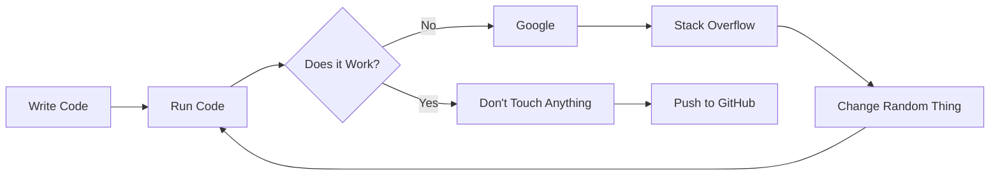

# 👋 Hey, I'm Manish Bhusal

<p align="center">
  
</p>

<p align="center">
  <a href="https://github.com/manisbhusal">
    
  </a>
  <a href="https://github.com/manisbhusal?tab=repositories">
    
  </a>
  
</p>

---

## 🧑‍💻 About Me

```text
╭──────────────────────────────────────────────╮
│                                              │
│  👨‍💻 Developer                               │
│  📍 Nepal 🇳🇵                                │
│  🎓 Computer Science Student                 │
│  🔥 Building random things on the internet   │
│  🐛 Creating bugs professionally             │
│  🍝 Writing questionable spaghetti code      │
│                                              │
╰──────────────────────────────────────────────╯
```

I'm a developer who enjoys building random projects, experimenting with new technologies, and occasionally wondering:

> **"Why did it work yesterday?"**

I like turning random ideas into actual projects — especially web apps, APIs, anime-related projects, automation tools, and whatever else I happen to be interested in that week.

### 🚀 Currently

* 🔨 Building random projects
* 🌐 Experimenting with web technologies
* 🧪 Learning by breaking things
* 📚 Improving my development skills
* 🐛 Hunting bugs (sometimes creating them first)

---

# 📊 GitHub Stats

<p align="center">
  
  
</p>

<p align="center">
  
</p>

---

# 🏆 GitHub Trophies

<p align="center">
  
</p>

---

# 📈 Contribution Graph

<p align="center">
  
</p>

---

# 🛠️ Tech Stack

### 💻 Languages

<p>
  
</p>

### 🌐 Web Development

<p>
  
</p>

### 🗄️ Databases & Backend

<p>
  
</p>

### ⚙️ Tools & Platforms

<p>
  
</p>

---

# 🚀 Things I Build

```text
Web Apps        ███████████████████░ 95%
APIs            █████████████████░░░ 85%
Random Ideas    ████████████████████ 100%
Debugging       ███████████░░░░░░░░░ 55%
Documentation   ███████░░░░░░░░░░░░░ 35%
Actually Reading
the Documentation █████░░░░░░░░░░░░░ 25%
```

---

# ⭐ Featured Projects

### 🎌 AniZone

A web-based anime streaming/discovery project focused on providing a clean anime experience.

**Tech:** `React` `TypeScript` `Vite` `APIs`

🔗 [Visit Project](https://anizone.xyz)

---

### 🎬 AniHubz

An anime-focused web application experimenting with anime discovery, tracking, and streaming-related features.

**Tech:** `React` `TypeScript` `AniList API`

🔗 [Visit Project](https://anihubz.vercel.app)

---

### 📅 Nepali Calendar

A simple web application for displaying the Nepali calendar with accurate dates and weekdays.

**Tech:** `Python` `Flask` `HTML` `CSS`

---

### 🖐️ Gesture Based Controller

A computer-vision project that uses hand gestures to control a computer.

**Tech:** `Python` `OpenCV` `MediaPipe` `PyAutoGUI`

---

# 🧠 What I'm Learning

```text
Frontend Development      ███████████████░░░░░ 75%
Backend Development       █████████████░░░░░░░ 65%
APIs & Integrations       ██████████████░░░░░░ 70%
Linux                      ████████████░░░░░░░░ 60%
Cloud & Deployment         ███████████░░░░░░░░░ 55%
System Design              ███████░░░░░░░░░░░░░ 35%
Writing Documentation      █████░░░░░░░░░░░░░░░ 25%
```

---

# 💻 My Developer Philosophy

> **If it works, don't touch it.**
>
> If you touch it and it breaks,
>
> **call it a feature.**

---

# 🐛 Debugging Workflow



---

# 📊 GitHub Activity

<p align="center">
  
</p>

---

# 🐍 Contribution Snake

<p align="center">
  
</p>

> If the snake isn't moving, I probably forgot to configure the GitHub Action. 🐍💀

---

# 🎯 2026 Goals

* [ ] Build more useful open-source projects
* [ ] Improve my backend development skills
* [ ] Learn more about system design
* [ ] Contribute to open source
* [ ] Build something people actually use
* [ ] Write better documentation
* [ ] Reduce spaghetti code from `99.1%` to `98.9%`
* [ ] Become slightly less dependent on Google
* [ ] Stop saying "I'll fix it later"

---

# 🎮 Outside of Code

```text
Anime        ████████████████████ 100%
Coding       ███████████████████░ 95%
Gaming       ███████████████░░░░░ 75%
Sleep        ███████░░░░░░░░░░░░░ 35%
Touching Grass ███░░░░░░░░░░░░░░░ 15%
```

---

# 🍕 Support My Work

> **"Cooking code, serving bugs."**

If you find my projects useful — or simply feel bad for the bugs I've created — you can support my work.

<p align="center">
  <a href="https://cr8.rs/kiwiixen">
    
  </a>
  <a href="https://cr8.rs/kiwiixen">
    
  </a>
</p>

<p align="center">
  <a href="https://cr8.rs/kiwiixen">
    ☕ <b>Support me here</b>
  </a>
</p>

---

# 🤝 Let's Connect

<p align="center">
  <a href="https://github.com/manisbhusal">
    
  </a>
</p>

---

# 💬 Random Developer Quote

<p align="center">
  
</p>

---

<p align="center">
  <b>Thanks for visiting my profile! 👋</b>
  <br/>
  <sub>Now go check my repositories before I introduce another bug. 🐛</sub>
</p>

<p align="center">
  
</p>
